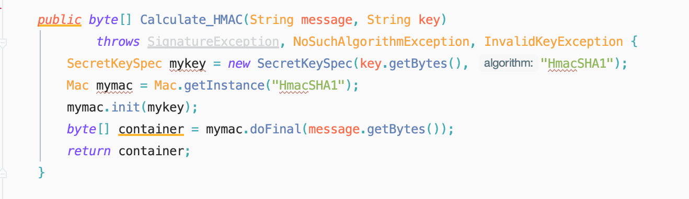
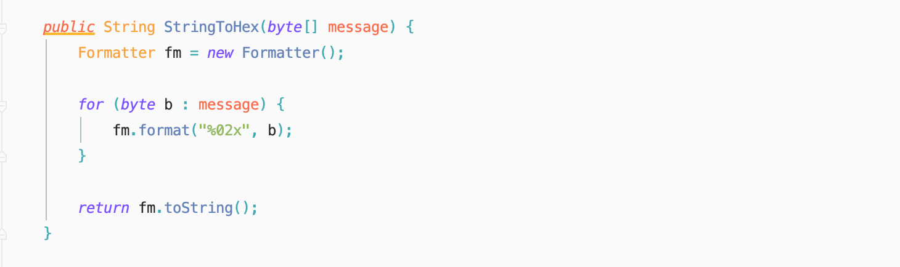
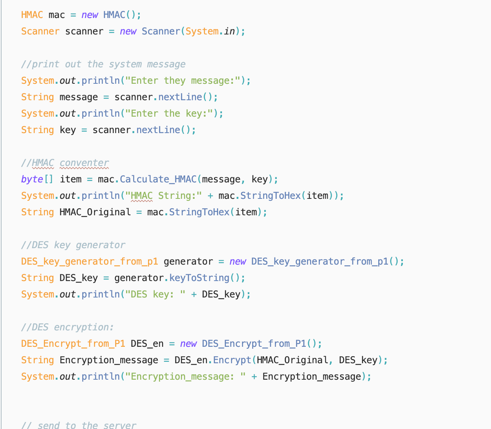
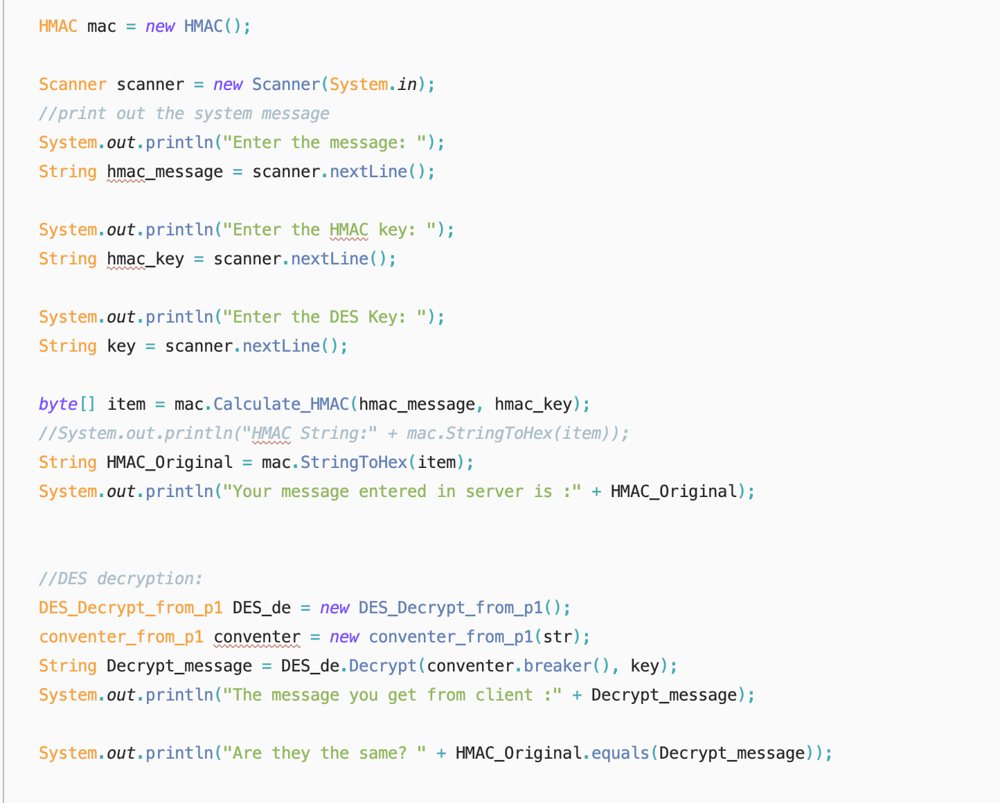

# Project 2
## Name: Chener Zhang
## Date: Feb 26 2020

### **what you have learned about HMAC;**
* HMAC is a one way hash function which to checkout whether the message has been motify; Even though the after decryption the message will be the same, without the HAMC function, it is hard to say the message is motify slightly or just a bit.


### **language and library you used**
#### We are using JAVA
```
import java.io.DataOutputStream;
import javax.crypto.*;
import java.util.Arrays;
import javax.crypto.KeyGenerator;
import javax.crypto.SecretKey;
import java.io.BufferedWriter;
import java.io.FileWriter;
import java.util.Base64;
import javax.crypto.Mac;
import javax.crypto.spec.SecretKeySpec;
import java.security.InvalidKeyException;
import java.security.NoSuchAlgorithmException;
import java.security.SignatureException;
import java.util.Formatter;
import java.io.BufferedReader;
import java.io.InputStreamReader;
import java.io.PrintStream;
import java.net.ServerSocket;
import java.net.Socket;
import java.util.Scanner;

```
---


## Code and Comment : 

```
public byte[] Calculate_HMAC(String message, String key)
    return byte[]; (in HMACA FORM)
```
* Enter the message and the key you prefer, it will return a message which has already done a hash function

### **problems you encountered and how you solved them**
* We do not have too much problems
* The only problems we have is improve the efficiency of client and server transfer
---

### **Screen captures** 

* Take the user input from different method
* Do the same thing we have done in DES such as getInstance and doFinal
---


* basically turn byte[] return as String
---

* Combine the client code with user input and send it to server.
Decrypt the message using DES before send it to the Server
---

* Once receive the message, do the decryption. Compare to input stream and check whether they are the same
* if they are the same return True
* else return False
---