# Assignment 6


### The library i have used
```
import java.security.*;
import java.util.Base64;
import javax.crypto.BadPaddingException;
import javax.crypto.Cipher;
import javax.crypto.IllegalBlockSizeException;
import javax.crypto.NoSuchPaddingException;
import java.security.*;
import java.security.spec.InvalidKeySpecException;
import java.util.Arrays;
import java.security.PrivateKey;
import java.security.NoSuchAlgorithmException;
import java.security.InvalidKeyException;
```
### package i have created
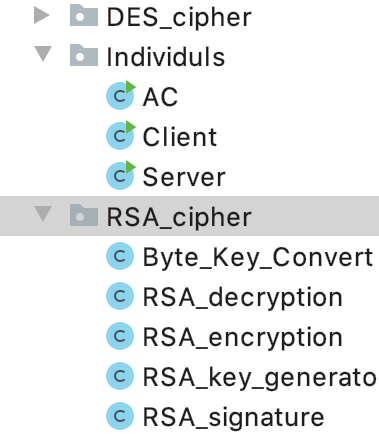
### RSA KEY GENERATOR
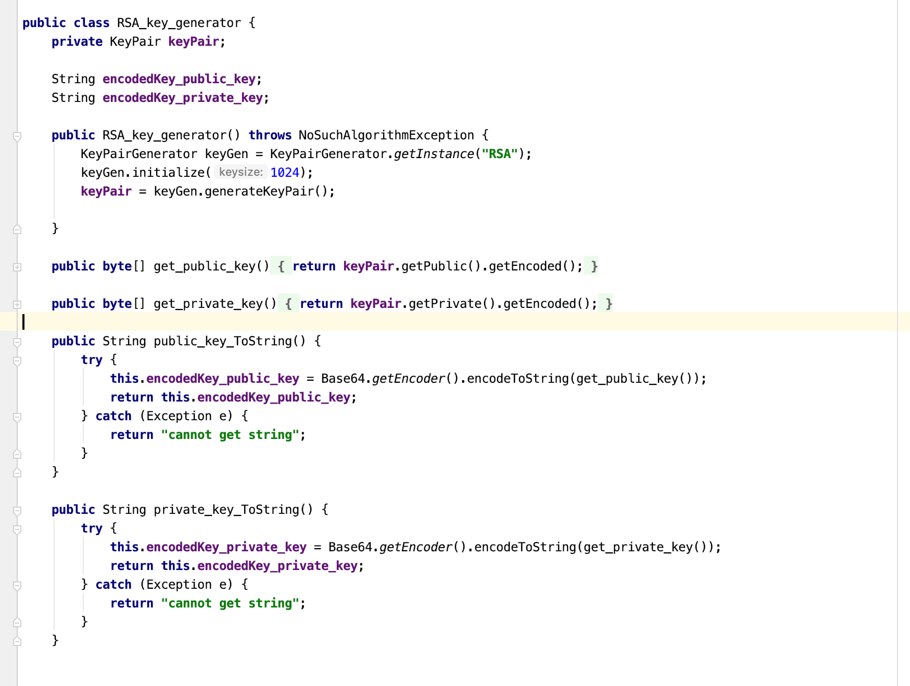
### RSA ENCRYPTION
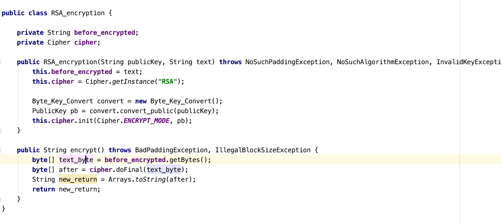
### RSA DECRYPTION
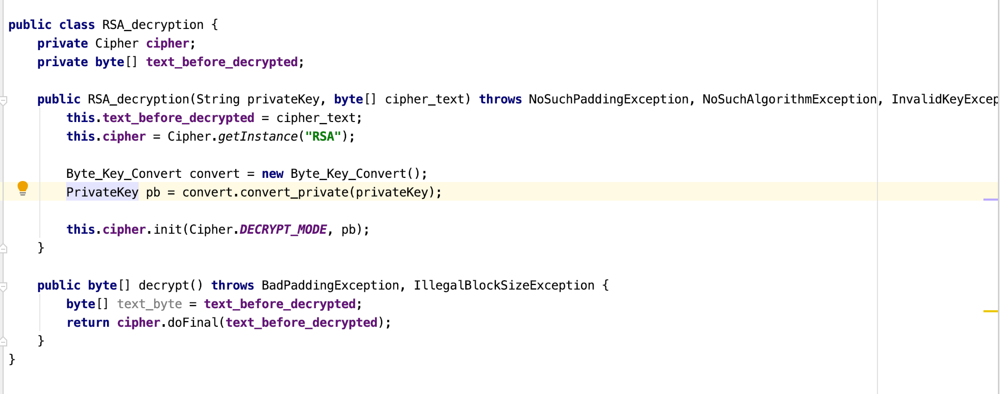
## Step 1:
```
send:
the Server ID
Time session 1
Des_key 1 
to:
AC
```

setup the message which need to send
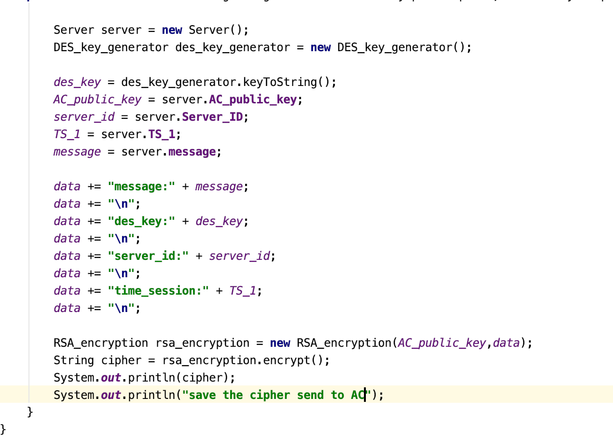
get the cipher text with the following image and send through the server to AC
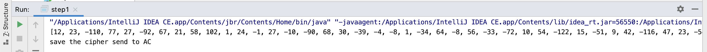

## Step 2

enter the cipher to the console, let the CA encrypt decryp the cipher by RSA and encrypt by DES

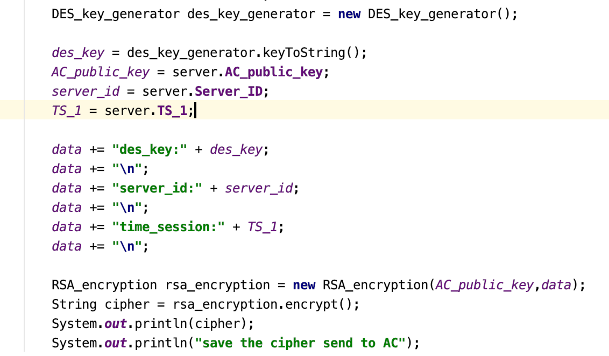
in the console you will get
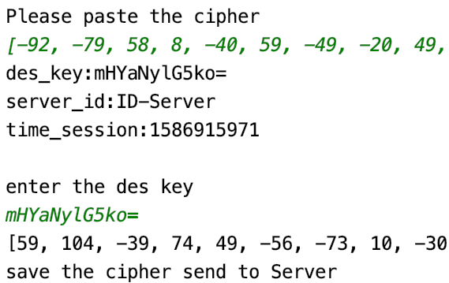

## Step 3
we will send the message to Client to Server again
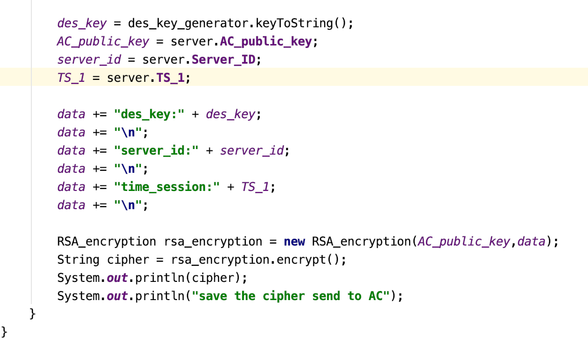
## Step 4
we will decrypte the previous message and store the public key
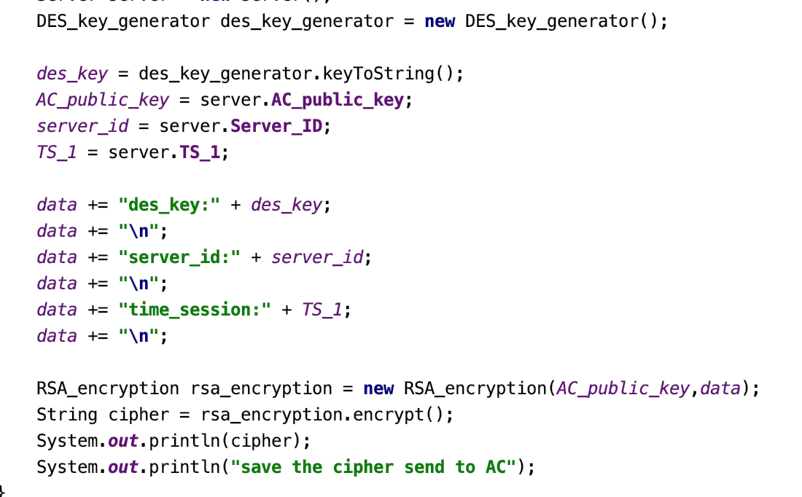
here is the public and private key after the decryption(it only visible in Server Side)
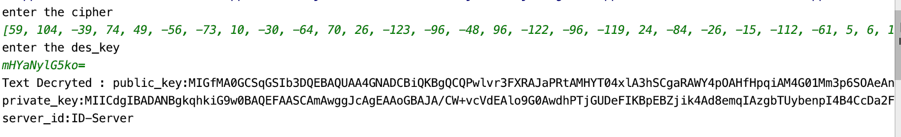
## Step 5
you will send the public key to encrypted the message and send to the server again by using RSA Algorithem
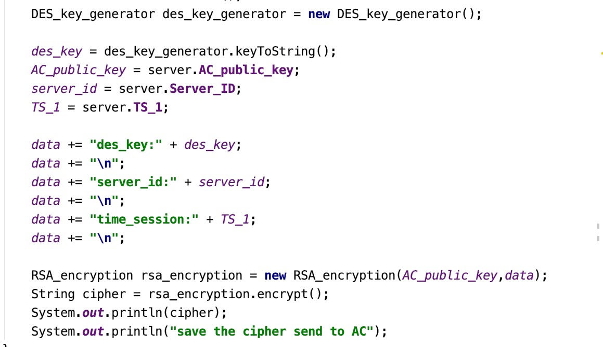
then send the follow cipher to the server
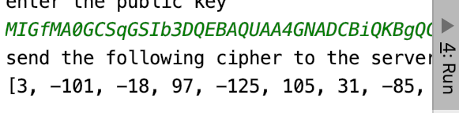
## Step 6
in order to get the message, you will need to use the private key to decrypted the message and re-generate a new DES key for the next encryption
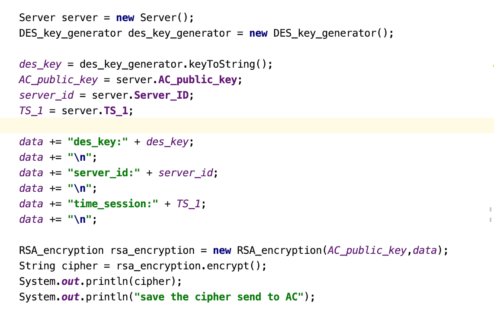
you will get the very detail imformation about what you received and just send 
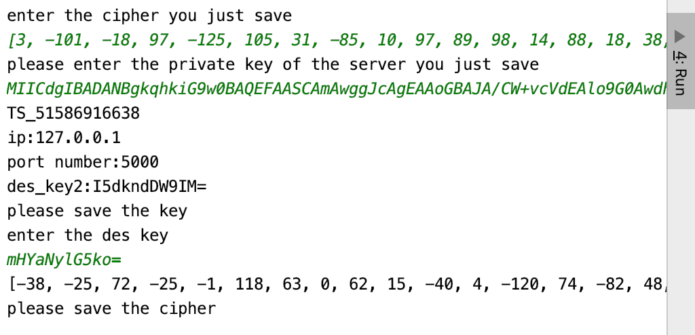

## Step 7
you will encrypted the mesaage again for the final delivery
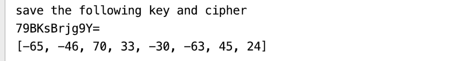
## Step 8
get the message from the final deliver
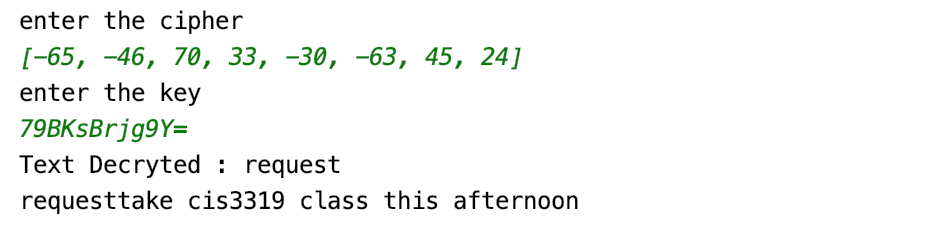